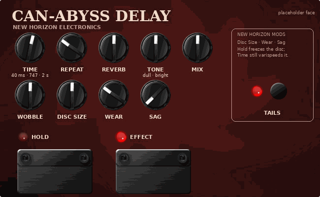

# Can-Abyss Delay

**Stare into the Can-Abyss, and it echoes back.**

Can-Abyss Delay by New Horizon Electronics recreates the 1960s electrostatic "oil can" delay (Ray Lubow's Tel-Ray, sold as Ad-N-Echo and Morley) for MOD Duo, Duo X and Dwarf. Faithful first, then modern mods.



> The face is a **placeholder** until the real artwork lands.

## Why it sounds like nothing else

There's no tape and no erase head. A spinning disc in a can of oil holds the signal as charge, and the disc never fully forgets:

- **Echoes smear into a half-reverb wash.** Leftover charge comes round every revolution, fainter and darker each pass.
- **The motor sets the time.** Turn Time and the pitch bends, like tape. Freeze the disc with Hold and it still varispeeds.
- **The warble is mechanical.** Disc runout, belt drift, motor flutter and disc wear, locked to disc speed.
- **Clean by design.** The old units hissed and hummed; this one keeps the movement and drops the noise.
- **Long delays get darker by themselves**, because the disc surface moves slower past the wiper.

## Controls

| Control | What it does |
| --- | --- |
| Time | Motor speed: 40 ms to 2 s (747 ms marks the Morley's ceiling). Sweeps bend pitch |
| Repeat | Feedback from the read wiper back to the write wiper; can run away |
| Reverb | Charge the disc keeps each revolution: the oil-can smear |
| Tone | Tilt EQ on the echoes: properly dull at 0, bright at 10 |
| Wobble | Motor, belt and runout warble; 5 = stock, 10 = about 4x |
| Disc Size | 5 = stock. Bigger (to 2x) = brighter, steadier, heavier. Smaller (to a quarter) = darker, warblier, twitchier |
| Wear | A worn disc: speed and level wobbles tied to disc position, so they repeat every revolution and build in the tails. 0 = new, 3 = stock, 10 = beaten up |
| Mix | Dry/wet on Mix Out |
| Sag | Tube supply droop on hard hits, plus a motor slip that dips the pitch (up to about a semitone) |
| Hold | Freezes the disc (latching); Time still varispeeds the loop |
| Tails | Bypass lets the repeats ring out |
| Effect | Bypass, click-free; dry at unity |

Mono in. **Mix Out** carries dry + wet; **Wet Out** carries 100% wet. They are not a stereo pair.

## Install

**Test builds:** upload `mod-plugin-builder/nhe-can-abyss/nhe-can-abyss.mk` to <https://builder.mod.audio/buildroot> with your MOD connected over USB, then click Install. Set `NHE_CAN_ABYSS_VERSION` in that file to the commit you want to build.

**MOD Plugin Store:** not yet. See [docs/release.md](docs/release.md).

## Build from source

```sh
make                 # builds bin/nhe-can-abyss.lv2
make install DESTDIR=/path PREFIX=/usr
```

DPF (DISTRHO Plugin Framework) is vendored in `dpf/` at commit `61d38eb638449647fb8395a35c5b8dab7e981ba7`, so no submodules are needed. Cross-compile by setting `CC`, `CXX` and `CXXFLAGS` as usual.

The design, sources and mappings are in [docs/spec.md](docs/spec.md). Testing, the face workflow and the release checklist are in [docs/development.md](docs/development.md).

## Repository layout

| Path | Contents |
| --- | --- |
| `plugins/can-abyss/` | DSP source (C++, DPF) |
| `bundle/nhe-can-abyss.lv2/` | LV2 metadata, pedal face (template, CSS, script, images) |
| `assets/source/` | Source artwork for the face (to come) |
| `mod-plugin-builder/` | Package file for MOD's builder and plugin store |
| `tools/` | Offline LV2 test host, audio test suite, CPU benchmark, face renderer |
| `docs/` | Spec, development process, release checklist |
| `dpf/` | Vendored DISTRHO Plugin Framework (ISC) |

## Licence

Code: MIT ([LICENSE](LICENSE)). Artwork: © New Horizon Electronics ([ARTWORK-LICENSE.md](ARTWORK-LICENSE.md)). DPF: ISC ([dpf/LICENSE](dpf/LICENSE)).

Tel-Ray, Ad-N-Echo and Morley are trademarks of their owners. This is an independent recreation, not affiliated with or endorsed by them.
