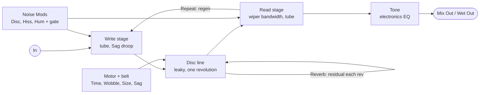

# Can-Abyss Delay — Plugin Spec v0.1

Oct 5, 2026 · Niels (New Horizon Electronics)

## Concept

A MOD Duo recreation of Ray Lubow's 1960s electrostatic "oil can" delay (Tel-Ray, Ad-N-Echo, Morley): faithful first, then New Horizon modern mods. Name: **New Horizon Electronics Can-Abyss Delay** (repo `Kiwooky/NHE-Can-Abyss`, bundle `nhe-can-abyss`, URI `https://github.com/Kiwooky/NHE-Can-Abyss`, package `mod-plugin-builder/nhe-can-abyss/nhe-can-abyss.mk`).

**How the original works.** A motor and rubber belt spin an anodised disc inside a sealed can with a film of dielectric oil. A rubber write wiper deposits the signal as charge; a read wiper picks it up later. First echo = wiper angle ÷ rotation speed.

**The defining trick: the disc never fully forgets.** There is no erase head, so leftover charge comes round again every revolution, fainter and blurrier each pass. That residual smear is the oil can's half-reverb wash. Motor, belt and disc runout add a warble whose speed is tied to disc speed.

**Design rule:** the model is built from the mechanism, not from a generic delay plus chorus. Mods change how the machine is built (disc size, motor sag, speed range), so they behave the way physics says they would.

## Sources and provenance

Every feature is tagged by where it comes from, so faithful claims stay honest.

| Feature | Basis | Reference |
| --- | --- | --- |
| Residual charge, repeats at rotation period | Documented behaviour | [Strymon: oil can preset notes](https://www.strymon.net/this-weeks-preset-timeline-oil-can-delay/) |
| Warble from AC motor, belt and oil | Documented behaviour | [Strymon](https://www.strymon.net/this-weeks-preset-timeline-oil-can-delay/) |
| Wobble speed tied to delay time | Commercial models | Strymon preset; [JHS 3 Series Oil Can](https://www.zzounds.com/item--JHS3SOCDELAY) |
| Disc, wipers, dielectric oil | Documented mechanism | [Premier Guitar: Morley EVO-1](https://www.premierguitar.com/gear/the-mighty-morley-evo-1) |
| 747 ms ceiling, 8-way time switch | Morley 747 | [Equipboard oil can guide](https://equipboard.com/posts/oil-can-delays) |
| Varispeed motor | Owner wish; real cans fought it | [Tel-Ray Oilcan Addicts forum](https://www.tapatalk.com/groups/telrayoilcanaddicts/maintenance-and-repairs-t406-s20.html) |
| Extra / moved heads (parked) | Owner experiments | Tel-Ray Oilcan Addicts forum |
| "Oil" as a control | Commercial model + forum | Catalinbread Adineko Viscosity; forum note that diluting the fluid lowers signal |
| Disc Size macro | Claude, from first principles | Surface-speed physics; oil-film dropouts are speculation |
| Predictive gate (Hush in noise knobs) | Claude | Only possible digitally |
| Sag into motor slip | Claude | Inspired, not faithful: motor type unverified |
| Hold (freeze) | Niels's MultiPlay | NHE MultiPlay 20/20 |
| Noise Mods unlock switch | Niels | Same pattern as MultiPlay Slam |

No schematic or recording of a real unit has been used yet. All mappings below are guesses until checked against one.

## Signal flow

Two loops make the sound: Repeat feeds the read wiper back to the write wiper, and Reverb keeps leftover charge circling the disc.

The motor sets where the read point sits, so Time, Wobble, Disc Size and Sag all move pitch. Write-side hiss enters inside both loops; disc crackle, read hiss and hum enter at the read stage, inside the Repeat loop.

- **Disc line:** one float line; the read point follows integrated motor speed, so varispeed bends pitch like tape.
- **Residual tap:** one revolution behind the write point, scaled by Reverb, through a one-pole loss per pass.
- **Write and read stages:** rational-tanh tube curves; Sag droops the write stage on hard hits.
- **Bandwidth:** set by surface speed (Disc Size and Time), separate from Tone.
- **Envelope track:** a low-rate copy of the disc envelope rides the same line and drives the noise gate.

## Ports

Mono in, two outs, 16 controls in enum order. Hand-written TTL must match this table index for index.

| # | Symbol | Name | Range | Default | Notes |
| --- | --- | --- | --- | --- | --- |
| 0 | `in` | Audio In | audio |  | Mono |
| 1 | `out_mix` | Mix Out | audio |  | Dry + wet by Mix |
| 2 | `out_wet` | Wet Out | audio |  | 100% wet; labelled on face |
| 3 | `time` | Time | 40–2000 ms | 350 | Logarithmic; 747 marked |
| 4 | `repeat` | Repeat | 0–10 | 3 | Regen, read → write; can run away |
| 5 | `reverb` | Reverb | 0–10 | 5 | Residual charge per revolution |
| 6 | `tone` | Tone | 0–10 | 5 | Electronics EQ on wet |
| 7 | `wobble` | Wobble | 0–10 | 5 | 5 = stock warble |
| 8 | `disc_size` | Disc Size | 0–10 | 5 | 5 = stock; macro |
| 9 | `mix` | Mix | 0–100 % | 50 | Mix Out only |
| 10 | `sag` | Sag | 0–10 | 0 | 0 = off |
| 11 | `hold` | Hold | toggle | 0 | Momentary by default |
| 12 | `noise_mods` | Noise Mods | toggle | 0 | 0 = locked (stock) |
| 13 | `disc_noise` | Disc | 0–10 | 5 | Live only when unlocked |
| 14 | `hiss` | Hiss | 0–10 | 5 | Live only when unlocked |
| 15 | `hum` | Hum | 0–10 | 5 | Live only when unlocked |
| 16 | `hum_hz` | Hum Hz | 50 / 60 | 60 | Enumeration |
| 17 | `tails` | Tails | toggle | 1 | Bypass keeps repeats |
| 18 | `lv2_enabled` | Enabled | bypass | 1 | `lv2:enabled` designation, last |

Defaults for Repeat, Reverb, Tone and Mix are placeholders until tuned by ear. Version starts at `d_version(1,0,0)` = minorVersion 2, microVersion 0.

## Mappings (all guesses)

Starting values to tune by ear; none are measured from a real unit. Knobs are 0–10 with x = knob/10 unless stated.

| Control | Mapping | Notes |
| --- | --- | --- |
| Time | T = 40 ms × 50^x on the knob's 0–1 travel | 747 ms sits at 75% travel |
| Revolution | P = T / 0.9 (read wiper at 324°) | Residual repeats at T + nP |
| Motor inertia | speed slews with τ = 200 ms × S | Glide on varispeed; S = Disc Size factor |
| Disc Size factor | S = 2^((knob − 5)/5), range 0.5–2 | 5 = stock |
| Bandwidth | fc = 3.5 kHz × √(S × 350 ms / T), clamped 0.8–8 kHz | Slow or small disc = darker |
| Reverb | residual r = 0.85x per revolution, plus a one-pole loss per pass (1.5 × fc) | Stock r ≈ 0.43 |
| Repeat | loop gain = 1.1 × x^1.2 | Over 1 runs away; tanh stage catches it |
| Tone | high shelf above 1.5 kHz: −9 dB (0) … 0 dB (5) … +6 dB (10) | Out of the loop |
| Wobble, per rev | ±0.045% of the revolution × (knob/5) ÷ S, once per rev | Locked to disc speed |
| Wobble, belt + flutter | 0.37 + 0.61 Hz drift (0.12%) + 3–10 Hz flutter (0.004%), × knob/5 ÷ S × stock speed ÷ current speed | Measured: 4.5 cents RMS stock, the same at any Time |
| Sag, supply | follower 5 ms / 150 ms; up to 6 dB droop on the write stage | Bloom and compression |
| Sag, motor slip | up to −3% speed × x ÷ S, recovering with motor inertia | Modern mod |
| Noise stock levels | disc −66, hiss −70, hum −72 dBFS (wet path, before regen) | Measured floor ≈ −64 dBFS at the wet out |

## Noise Mods

One switch, three knobs: locked plays stock noise, unlocked hands Disc, Hiss and Hum to the player. Same pattern as the MultiPlay's Slam.

- **Locked:** the three knobs are ignored and stock values run. Knob positions are kept, so unlocking restores your custom settings exactly.
- **Switching** glides over about 50 ms, so it never clicks. Footswitch it for instant A/B.
- **Noise sources:** Disc = crackle from a one-revolution table indexed by disc position, so it repeats every rev. Hiss = tube noise at the write and read stages. Hum = 50/60 Hz wavetable (fundamental + 3 harmonics).
- **All noise enters inside the regen loop,** so it builds up on long repeats like the real thing.

**Each knob, 12 o'clock = stock:**

| Knob | Turn | Result |
| --- | --- | --- |
| 10 → 5 | Right half | Level from +12 dB down to stock |
| 5 → 1.5 | Left, first | Predictive gate deepens to −30 dB in the gaps; noise under notes stays |
| 1.5 → 0 | Left, last | Source fades out; at 0 its generator is skipped |

**Predictive gate.** A low-rate envelope of what is written to the disc travels with the audio, residual decay included. Write-side noise is gated by the signal it is written with; read-side noise looks at the envelope arriving 3 ms ahead. The gate opens exactly when an echo arrives and closes in the silences. Hardware could never know its own future echoes.

## CPU and memory

Measured relative cost: about 1.25× Taj Mahal and just under the MultiPlay (Duo build under emulation, `tools/bench.py`). The absolute load is only known from the Duo's meter. Cost per sample stays flat from 40 ms to 2 s.

| Block | Cost | How |
| --- | --- | --- |
| Delay line + residual tap | Medium | Hermite read at the wiper, linear read at the revolution tap, one write |
| Per-pass smear | Tiny | One one-pole filter in the residual loop |
| Wobble, flutter, slip | Small | Parabolic sine; flutter noise at control rate |
| Tube stages ×3 | Small | Rational tanh, no oversampling |
| Tone + bandwidth | Small | One biquad (retuned every 16 samples) + one-pole shelf |
| Noise sources | Tiny | Disc table, hum wavetable, xorshift hiss |
| Predictive gate | Small | Envelope track at 1/16 rate, lookahead read at control rate |
| Disc Size, Sag maths | Free / tiny | Control-rate every 16 samples, smoothed |

**Memory:** one 2 MB float line (5.4 s at 96 kHz: the loop plus one older revolution for a click-free Hold seam), plus the envelope track and noise tables, all allocated once in the constructor.

**Rules:** no `pow`, `exp`, `sin` or `tanh` per sample; denormal guards (1e-18) in every feedback path; Noise Mods locked runs fixed values; a noise knob at 0 skips its generator.

**Engine choice:** a tape-style line whose read point follows integrated motor speed, not a fixed-cell disc. A cell disc would write about 19 cells per sample at 40 ms.

## Test plan

The standard rig (native, arm32, arm64; TTL vs DPF generator; lv2info; lv2host; qemu match), plus these oil-can checks. All pass in `tools/catest.py` on the native and Duo builds.

- [x] Impulse: first echo at T, residual repeats every P = T/0.9, each pass darker and quieter (44.1/48/96 kHz)
- [x] Time sweep 40 ms → 2 s and back: no NaN/Inf, bounded
- [x] Long times darken by themselves; Disc Size 10 restores brightness
- [x] Repeat 10 + Reverb 10 + Sag 10 + everything at max: finite and bounded
- [x] Hold: loop keeps spinning, ignores new input, varispeeds with Time (×2 = octave down), click-free in and out
- [x] Noise Mods: locked output identical whatever the knob positions; unlock glides
- [x] Noise knobs at 0: silent
- [x] Predictive gate: gaps 20+ dB quieter, echoes untouched
- [x] Bypass with Tails on and off: dry at unity, click-free
- [x] Warble: 3–6 cents RMS stock, independent of Time; Wobble 10 doubles it; big disc steadier
- [x] CPU benchmark against Taj Mahal and MultiPlay
- [ ] The Duo's CPU meter

## Face notes

Eight main knobs, four switches, and a trim row behind Noise Mods. The first release ships a **placeholder face** (borrowed MultiPlay knob and switch art); the real artwork replaces it.

- **Main knobs:** Time, Repeat, Reverb, Tone, Wobble, Disc Size, Mix, Sag.
- **Switches:** Hold, Noise Mods, Tails, Bypass (LED lit when active).
- **Trim row:** Disc, Hiss, Hum as small trim pots, plus a 50/60 Hz Hum switch, dimmed while locked.
- **Time scale:** 747 marked as the faithful line; past it is the "slow motor" zone.
- **Jacks:** label Mix Out and Wet Out so they aren't mistaken for stereo.
- **Assets from Niels:** background with black placeholder holes, knob body and marker layers, a small trim-pot body, button on/off states.

## Parked and open

**Parked for v1.1:** a second read head for stereo; a movable read head; an 8-step Morley 747 mode for Time.

**Open questions:**

- [ ] Is the stock noise floor (≈ −64 dBFS) right, or too noisy?
- [ ] Is there a schematic or recording of a real Tel-Ray or Morley to tune against?
- [ ] Were the original motors induction types that would actually slip under sag?
- [ ] Face artwork
