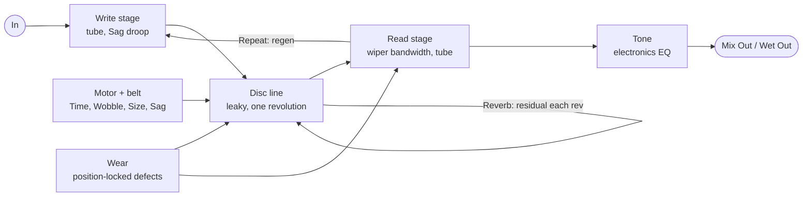

# Can-Abyss Delay — Plugin Spec v0.2

Oct 5, 2026 · Niels (New Horizon Electronics) · v0.2 after the first hardware test (plugin 1.0.1)

## Concept

A MOD Duo recreation of Ray Lubow's 1960s electrostatic "oil can" delay (Tel-Ray, Ad-N-Echo, Morley): faithful first, then New Horizon modern mods. Name: **New Horizon Electronics Can-Abyss Delay** (repo `Kiwooky/NHE-Can-Abyss`, bundle `nhe-can-abyss`, URI `https://github.com/Kiwooky/NHE-Can-Abyss`, package `mod-plugin-builder/nhe-can-abyss/nhe-can-abyss.mk`).

**How the original works.** A motor and rubber belt spin an anodised disc inside a sealed can with a film of dielectric oil. A rubber write wiper deposits the signal as charge; a read wiper picks it up later. First echo = wiper angle ÷ rotation speed.

**The defining trick: the disc never fully forgets.** There is no erase head, so leftover charge comes round again every revolution, fainter and blurrier each pass. That residual smear is the oil can's half-reverb wash. Motor, belt and disc runout add a warble whose speed is tied to disc speed.

**Design rule:** the model is built from the mechanism, not from a generic delay plus chorus. Mods change how the machine is built (disc size, motor sag, speed range), so they behave the way physics says they would.

## Sources and provenance

Every feature is tagged by where it comes from, so faithful claims stay honest.

| Feature | Basis | Reference |
| --- | --- | --- |
| Residual charge, repeats at rotation period | Documented behaviour | [Strymon: oil can preset notes](https://www.strymon.net/this-weeks-preset-timeline-oil-can-delay/) |
| Warble from AC motor, belt and oil | Documented behaviour | [Strymon](https://www.strymon.net/this-weeks-preset-timeline-oil-can-delay/) |
| Wobble speed tied to delay time | Commercial models | Strymon preset; [JHS 3 Series Oil Can](https://www.zzounds.com/item--JHS3SOCDELAY) |
| Disc, wipers, dielectric oil | Documented mechanism | [Premier Guitar: Morley EVO-1](https://www.premierguitar.com/gear/the-mighty-morley-evo-1) |
| 747 ms ceiling, 8-way time switch | Morley 747 | [Equipboard oil can guide](https://equipboard.com/posts/oil-can-delays) |
| Varispeed motor | Owner wish; real cans fought it | [Tel-Ray Oilcan Addicts forum](https://www.tapatalk.com/groups/telrayoilcanaddicts/maintenance-and-repairs-t406-s20.html) |
| Extra / moved heads (parked) | Owner experiments | Tel-Ray Oilcan Addicts forum |
| "Oil" as a control | Commercial model + forum | Catalinbread Adineko Viscosity; forum note that diluting the fluid lowers signal |
| Disc Size macro | Claude, from first principles | Surface-speed physics; oil-film dropouts are speculation |
| Wear (position-locked disc defects) | Claude, from Niels's test | In testing, the Disc noise was liked for the movement it added, not the crackle |
| Sag into motor slip | Claude | Inspired, not faithful: motor type unverified |
| Hold (freeze) | Niels's MultiPlay | NHE MultiPlay 20/20 |
| Clean by design (no hiss or hum) | Niels's hardware test | Noise Mods cut in 1.0.1 |

No schematic or recording of a real unit has been used yet. All mappings below are guesses until checked against one.

## Signal flow

Two loops make the sound: Repeat feeds the read wiper back to the write wiper, and Reverb keeps leftover charge circling the disc.

The motor sets where the read point sits, so Time, Wobble, Disc Size, Wear and Sag all move pitch. Wear also dips the level at the read wiper; both effects sit inside the loops, so they build in the tails.

- **Disc line:** one float line; the read point follows integrated motor speed, so varispeed bends pitch like tape.
- **Residual tap:** one revolution behind the write point, scaled by Reverb, through a one-pole loss per pass.
- **Write and read stages:** rational-tanh tube curves; Sag droops the write stage on hard hits.
- **Bandwidth:** set by surface speed (Disc Size and Time), separate from Tone.
- **Wear profile:** one revolution of smooth speed bumps plus worn patches, read at the disc's current position.

## Ports

Mono in, two outs, 12 controls in enum order. Hand-written TTL must match this table index for index. (1.0.1 removed the noise ports and added Wear; ports freeze before the first public release.)

| # | Symbol | Name | Range | Default | Notes |
| --- | --- | --- | --- | --- | --- |
| 0 | `in` | Audio In | audio |  | Mono |
| 1 | `out_mix` | Mix Out | audio |  | Dry + wet by Mix |
| 2 | `out_wet` | Wet Out | audio |  | 100% wet; labelled on face |
| 3 | `time` | Time | 40–2000 ms | 350 | Logarithmic; 747 marked |
| 4 | `repeat` | Repeat | 0–10 | 3 | Regen, read → write; can run away |
| 5 | `reverb` | Reverb | 0–10 | 5 | Residual charge per revolution |
| 6 | `tone` | Tone | 0–10 | 5 | Tilt EQ on wet |
| 7 | `wobble` | Wobble | 0–10 | 5 | 5 = stock warble |
| 8 | `disc_size` | Disc Size | 0–10 | 5 | 5 = stock; macro |
| 9 | `wear` | Wear | 0–10 | 3 | 0 = new disc; 3 = stock |
| 10 | `mix` | Mix | 0–100 % | 50 | Mix Out only |
| 11 | `sag` | Sag | 0–10 | 0 | 0 = off |
| 12 | `hold` | Hold | toggle | 0 | Latching |
| 13 | `tails` | Tails | toggle | 1 | Bypass keeps repeats |
| 14 | `lv2_enabled` | Enabled | bypass | 1 | `lv2:enabled` designation, last |

Defaults for Repeat, Reverb, Tone and Mix are placeholders until tuned by ear. Version `d_version(1,0,2)` = minorVersion 2, microVersion 2.

## Mappings (all guesses)

Starting values to tune by ear; none are measured from a real unit. Knobs are 0–10 with x = knob/10 unless stated.

| Control | Mapping | Notes |
| --- | --- | --- |
| Time | T = 40 ms × 50^x on the knob's 0–1 travel | 747 ms sits at 75% travel |
| Revolution | P = T / 0.9 (read wiper at 324°) | Residual repeats at T + nP |
| Motor inertia | speed slews with τ = 200 ms × S | Glide on varispeed; S = Disc Size factor |
| Disc Size factor | S = 2^((knob − 5)/2.5) below 5, 2^((knob − 5)/5) above; range 0.25–2 | 5 = stock; 0 = quarter size |
| Bandwidth | fc = 3.5 kHz × √(S × 350 ms / T), clamped 0.8–8 kHz | Slow or small disc = darker |
| Reverb | residual r = 0.85x per revolution, plus a one-pole loss per pass (1.5 × fc) | Stock r ≈ 0.43 |
| Repeat | loop gain = 1.1 × x^1.2 | Over 1 runs away; tanh stage catches it |
| Tone | tilt around 1.2 kHz: highs −24 dB / lows +3 dB (0) … flat (5) … highs +9 dB / lows −6 dB (10) | Out of the loop |
| Wobble depth | W = knob/5 up to 5, then 1 + 3 × ((knob − 5)/5)^1.5 (4 at 10) | Measured: 3.7× stock at 10 |
| Wobble, per rev | ±0.045% of the revolution × W ÷ S, once per rev | Locked to disc speed |
| Wobble, belt + flutter | 0.37 + 0.61 Hz drift (0.12%) + 3–10 Hz flutter (0.004%), × W ÷ S × stock speed ÷ current speed | Measured: 4.5 cents RMS stock, the same at any Time |
| Sag, supply | follower 5 ms / 150 ms, full at about −20 dBFS (guitar level); up to 12 dB droop on the write stage | Measured: 4.4 dB less sustain at Sag 10 |
| Sag, motor slip | up to −5% ÷ S speed (capped at 15%) × x, recovering with motor inertia | Measured: hard hit dips 25 / 42 / 87 cents at Sag 3 / 5 / 10 |
| Wear | speed: ±0.12% of the revolution × x² ÷ S on a smooth 2nd–8th-harmonic profile; level: worn patches dipping up to 6 dB × x² | Measured: 5.8 cents at 3 (stock), 40 at 10 |

## Wear

What the first test showed: the Disc noise was useful only for the extra movement it seemed to add to the tails. Hiss and hum were switched off within seconds. So the noise section went, and Wear models the movement directly, without static.

- **Speed irregularities:** a smooth profile of one revolution (bumps from the 2nd to the 8th harmonic of the rotation) adds to the delay modulation. It is locked to disc position, so the same pattern repeats every revolution, which is classic oil can.
- **Level dips:** nine worn patches of varying width and depth lower the read level as they pass the wiper.
- **Builds in the tails:** both sit inside the Repeat and Reverb loops, so each pass picks up more.
- **Scales with disc size:** a defect matters more on a small disc (÷ S).
- **No noise anywhere:** silence in gives silence out at any setting.

## CPU and memory

Measured relative cost: about 0.7× Taj Mahal, the cheapest of the three New Horizon plugins (Duo build under emulation, `tools/bench.py`; 1.0.0 with the noise section was 1.25×). The absolute load is only known from the Duo's meter. Cost per sample stays flat from 40 ms to 2 s.

| Block | Cost | How |
| --- | --- | --- |
| Delay line + residual tap | Medium | Hermite read at the wiper, linear read at the revolution tap, one write |
| Per-pass smear | Tiny | One one-pole filter in the residual loop |
| Wobble, flutter, slip, wear | Small | Parabolic sine; flutter noise at control rate; two table reads per sample |
| Tube stages ×3 | Small | Rational tanh, no oversampling |
| Tone + bandwidth | Small | One biquad (retuned every 16 samples) + one-pole tilt |
| Disc Size, Sag maths | Free / tiny | Control rate every 16 samples, smoothed |

**Memory:** one 2 MB float line (5.4 s at 96 kHz: the loop plus one older revolution for a click-free Hold seam), plus two small wear tables, all allocated once in the constructor.

**Rules:** no `pow`, `exp`, `sin` or `tanh` per sample; denormal guards (1e-18) in every feedback path.

**Engine choice:** a tape-style line whose read point follows integrated motor speed, not a fixed-cell disc. A cell disc would write about 19 cells per sample at 40 ms.

## Test plan

The standard rig (native, arm32, arm64; TTL vs DPF generator; lv2info; lv2host; qemu match), plus these oil-can checks. All pass in `tools/catest.py` on the native and Duo builds.

- [x] Impulse: first echo at T, residual repeats every P = T/0.9, each pass darker and quieter (44.1/48/96 kHz)
- [x] Time sweep 40 ms → 2 s and back: no NaN/Inf, bounded
- [x] Long times darken by themselves; Disc Size 10 restores brightness
- [x] Repeat 10 + Reverb 10 + Sag 10 + everything at max: finite and bounded
- [x] Hold: loop keeps spinning, ignores new input, varispeeds with Time (×2 = octave down), click-free in and out
- [x] Clean: silence in, silence out with Wear, Sag, Wobble and Disc Size at their extremes
- [x] Tone: much duller at 0, brighter at 10
- [x] Sag at guitar level: hard hits dip the pitch more than 50 cents at 10; sustain droops more than 3 dB
- [x] Bypass with Tails on and off: dry at unity, click-free
- [x] Warble: 3–6 cents RMS stock, independent of Time; Wobble 10 and the quarter-size disc each 3–4.5×; big disc steadier; Wear 3 a light touch, Wear 10 more than 5×
- [x] CPU benchmark against Taj Mahal and MultiPlay
- [x] First hardware test (1.0.0): noise cut, ranges widened
- [ ] 1.0.1 on the Duo, including the CPU meter

## Face notes

Nine knobs, three switches. The first release ships a **placeholder face** (borrowed MultiPlay knob and switch art); the real artwork replaces it.

- **Knobs:** Time, Repeat, Reverb, Tone, Mix; Wobble, Disc Size, Wear, Sag.
- **Switches:** Hold, Tails, Bypass (LED lit when active).
- **Time scale:** 747 marked as the faithful line; past it is the "slow motor" zone.
- **Jacks:** label Mix Out and Wet Out so they aren't mistaken for stereo.
- **Assets from Niels:** background with black placeholder holes, knob body and marker layers, button on/off states.

## Parked and open

**Parked for v1.1:** a second read head for stereo; a movable read head; an 8-step Morley 747 mode for Time.

**Open questions:**

- [ ] Is there a schematic or recording of a real Tel-Ray or Morley to tune against?
- [ ] Were the original motors induction types that would actually slip under sag?
- [ ] Face artwork
